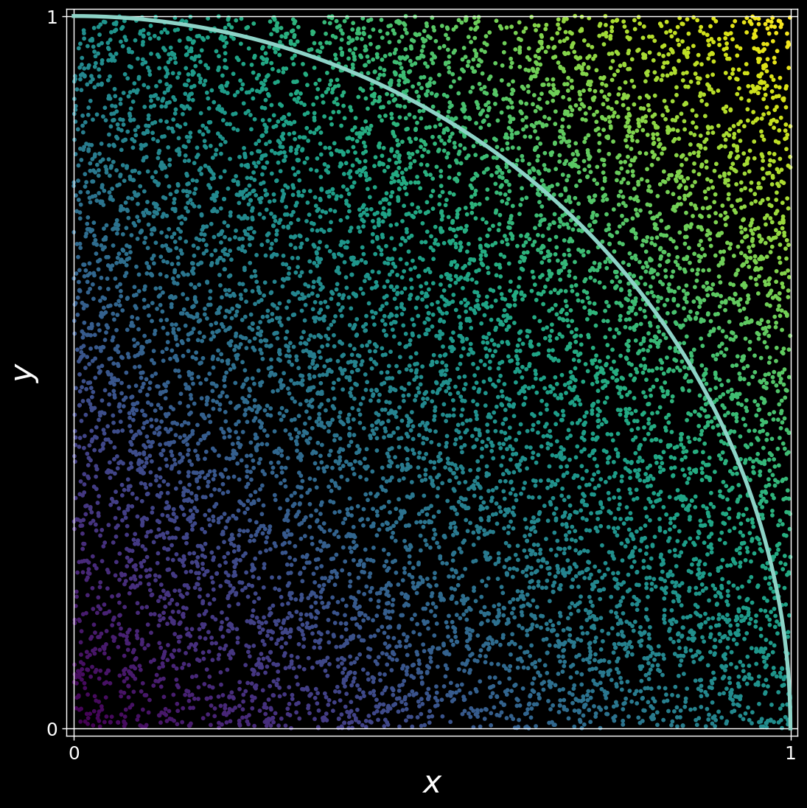

# Ejercicios de la sesión 9

**Instrucciones:**

En tu carpeta `Ejercicios` realiza lo siguiente:

**Ejercicios:**

1. Escribe un *script* en el que definas una clase llamada `Gato` con tres atributos: `nombre`,  `edad` y `vivo`. Al momento de instanciarse un objeto, se le debe pasar únicamente un nombre ya que la edad deberá ser `0` y el atributo `vivo` deberá ser `True`. Implementa un método `cumplir_años` que incremente en `1` la edad y que al llegar a `15` cambie el atributo `vivo` a `False`. Prueba el siguiente código en el mismo *script*.

    ```python
    gatito = Gato("Garfield")
    while gatito.vivo:
        gatito.cumplir_años()
    print(gatito.edad, gatito.vivo, gatito.nombre)
    ```

    Ver [solución](./Ejercicios09-01.md)


1. Define una clase llamada `Punto` con tres atributos, `x`, `y` y `dist`. Al momento de crear una instancia de esta clase debe asignarse al azar un número en el intervalo [0,1) y el atributo `dist` será la distancia euclidiana al origen [`(x**2 + y**2)**.5`]. **NOTA:** al inicio de tu archivo escribe lo siguiente para tener disponible una función llamada `random` que regresa un número en el intervalo [0,1).

    ```python
    from random import random
    ```
    
    Define el método `__repr__` de tal forma que tengas una *interfaz* así con el obteto:
    
    ```python
    >> p = Punto()
    >> print(p)
    El punto P(0.357,0.942) está a una distancia 1.008 del origen.
    ```

    Ver [solución](./Ejercicios09-02.md)


1. Vamos a aproximar el valor de Pi haciendo una simulación Monte Carlo reusando la clase que hiciste en el ejercicio anterior. La idea es dejar "caer" puntos al azar en un cuadrado unitario. La proporción de puntos que caen a menos de 1 del origen con respecto al total de puntos tiende a la razón del área del cuarto de círculo entre el área del cuadrado unitario.

     Ve la [plantilla](./Ejercicios09-03-blank.md) de solución para guiarte.

    - En un archivo de texto en la misma carpeta, copia y pega el código de tu clase `Punto` y guarda el archivo con el nombre `MisClases.py`.
    
    - En nuevo archivo de texto escribe esto al principio de tu archivo para que puedas usar tu clase.

        ```python
        from MisClases import Punto
        ```

    - Define una función `lanzar_puntos` que tome un argumento **por palabra** `n` y regrese el número de puntos que quedaron a **menos** de una distancia 1 del origen.

        ```python
        >> lanzar_puntos(n=100)
        80
        ```

    - Define una función `aproximar_pi` que tome también un argumento **por palabra** `n` y regrese una aproximación del valor de pi. Pi es aproximadamente 4 veces el número de puntos con una distancia menor a 1 del origen dividido por el número total de puntos en el cuadro unitario.

        ```python
        >> aproximar_pi(n=100)
        3.2
        ```

    - Define una función llamada `correr_experimento` que tome dos argumentos **por palabra**: `veces` y `n` y que regrese el **promedio** de ejecutar la función `aproximar_pi` un número `veces` de veces.

        ```python
        >> correr_experimento(veces=1_000, n=10_000)
        3.140981199999998
        ```

    Ver [solución](./Ejercicios09-03.md)

