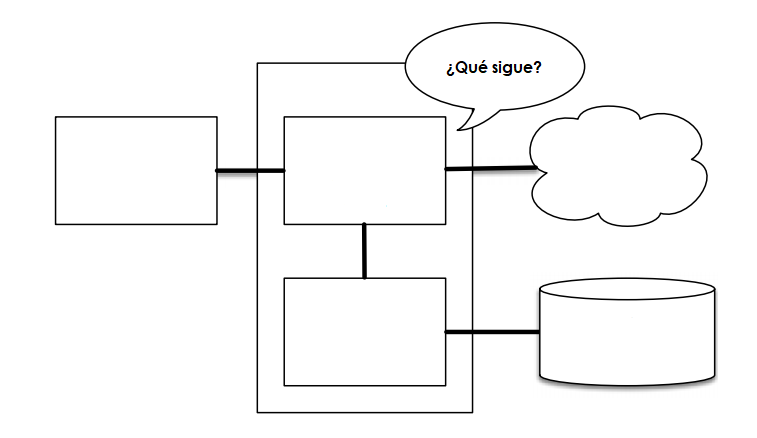

# Quiz 1: Introducción

1. ¿Cuál es la diferencia entre *software* de código abierto, *software* libre y *software* gratis?


1. ¿Qué es un sistema operativo (SO)? Da dos ejemplos de SO comerciales. 


1. ¿Qué es una licencia de *software*? Da dos ejemplos.


1. ¿Qué significa la palabra *bit*?


1. ¿Cuántos bits tiene un byte?


1. Explica qué significa que Python sea un lenguaje de programación...

	* ...de alto nivel __________________________
	
	* ...de tipado dinámico _____________________
	
	* ...interpretado ___________________________
	
	* ...multiparadigma _________________________
	
	* ...multiplataforma ________________________
	
1. ¿Qué hace un compilador?


1. Da un ejemplo de lenguaje de programación compilado.


1. ¿Qué es un intérprete?


1. ¿Por qué se dice que Python viene con "pilas incluidas"?


1. ¿Qué número decimal (en base 10) representa el siguiente número hexadecimal (base 16)?

	* `0x001A` ____________________

1. Completa el diagrama de la Figura 1 con los nombres de la siguiente tabla.
	
	| **Nombre** |
	|:-----:|
	| CPU 				|
	|Memoria principal	|
	|Memoria secundaria	|
	|Periféricos		|
	| Red 				|
	
	
	
1. ¿Qué es un *script*?


1. ¿Cuál es el resultado de ejecutar las siguientes expresiones en el intérprete de Python?
	
	```python
	>>> 2 ** 3
	
	>>> 5 // 2

	>>> 5 % 2  # punto extra: ¿cómo se llama este operador?
	```


1. ¿Cuál es el tipo y el valor del dato que tiene la variable `x` al final de la ejecución de cada bloque de expresiones?

	* ```python
		>>> x = 13 * 2
		>>> x = x - 10
		>>> x = x // 4
		```
	
	* ```python
		>>> x = 13 / 2
		>>> x = x - 3.5
		>>> x = x ** 2
		```
		
1. ¿Quién es el creador de Python?


1. ¿Qué proceso se sigue para proponer mejoras al lenguaje?


1. ¿De qué trata el PEP 8?


1. ¿Qué es PIP?

1. ¿Por qué usamos Anaconda para instalar Python?